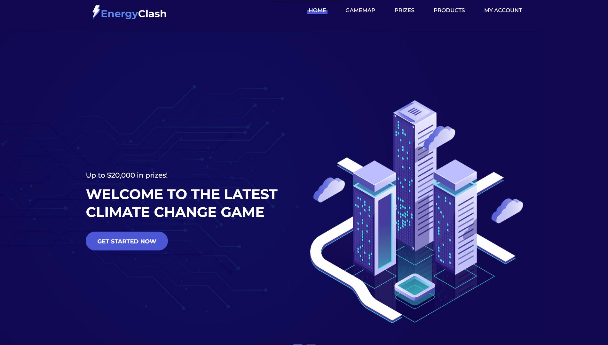
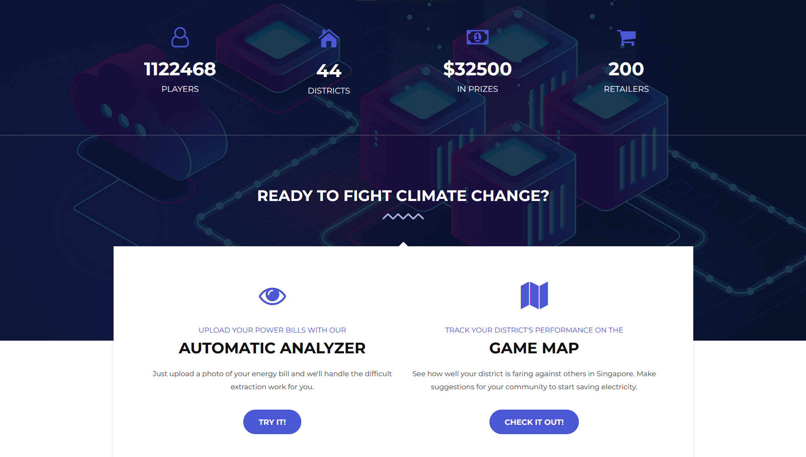
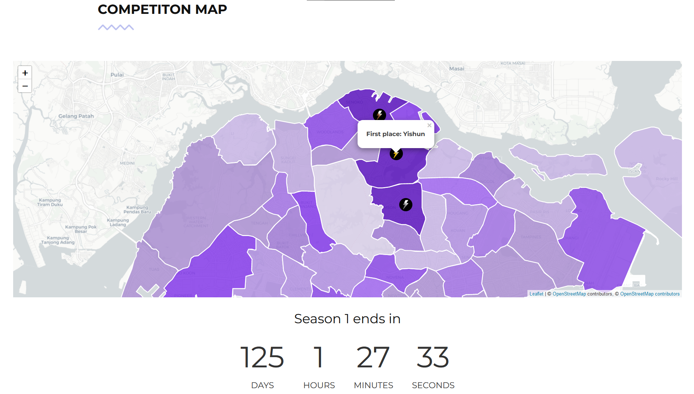
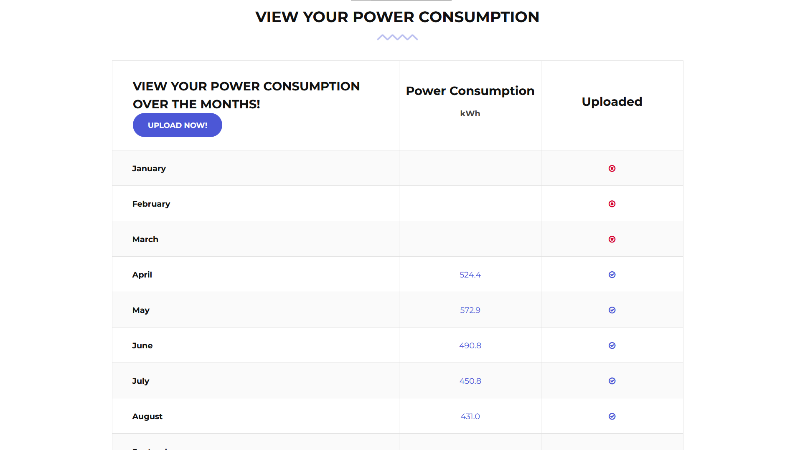
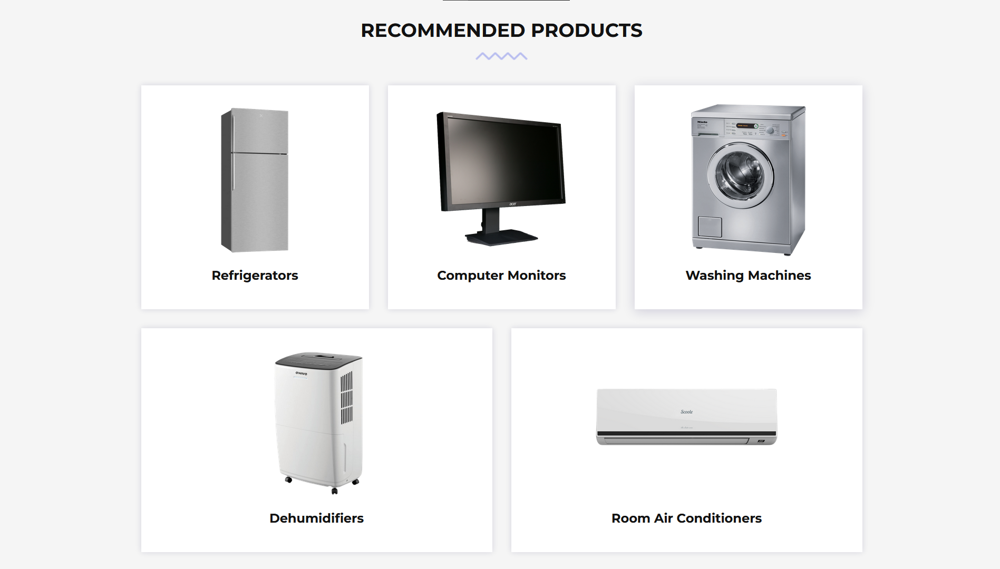
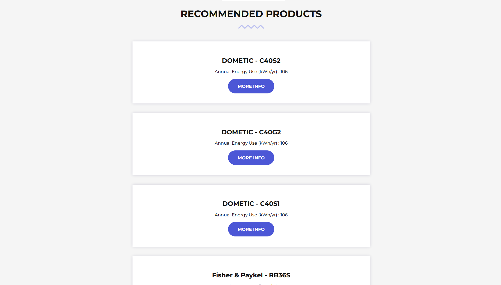

<div align="center">
     <!-- Logo -->
    <h1>Energy Clash</h1> <!-- Title -->
    <p>
      Web app targeted at reducing household electricity consumption via gamification.
    </p>
    <p>
      Built with: Python • Flask • SQLite • Bootstrap • Dropzone.js • Leaflet.js • Chart.js • Tesseract • OpenCV • Docker • Heroku 
    </p> <!-- Description -->
</div>

---

<details>
<summary>Table of Contents</summary>

- [About](#about)
- [Demo](#demo)
  - [Demo Video (for Github only)](#demo-video-for-github-only)
- [Getting Started](#getting-started)
  - [Prerequisites](#prerequisites)
- [Usage](#usage)
- [License](#license)
- [Credits](#credits)
</details>

## About

Web app targeted at reducing household electricity consumption via gamification.

Submission for Code Overflow 2022's problem statement: "How can we leverage technologies to combat climate change?"

*NOTE:* Heroku has [announced](https://blog.heroku.com/next-chapter) that all free hosting will end Nov 28 2022. With that said, hosting on Heroku will require 3 buildpacks, heroku/python, [heroku-buildpack-apt](https://buildpack-registry.s3.amazonaws.com/buildpacks/heroku-community/apt.tgz), [heroku-buildpack-tesseract](https://github.com/pathwaysmedical/heroku-buildpack-tesseract.git).

## Demo

**Home**





**Login / Sign Up**

**Competition Map:** Regional map displaying the leaderboard of the top districts of power saved.



**Prizes**: Seasonal prizes donated to charities in the respective districts.


**Upload Power Bill by User**

User uploads an image of a power bill for the given month. Sample images are in `assets/demo/`.

OCR (Optical Character Recognition) is used to extract power consumption.


**Power Consumption Overview for User**: Graphical overview of household's power consumption for each month.



**Recommended Products**: Displays energy efficient products scraped from [Energy Star](https://www.energystar.gov/).





### Demo Video (for Github only)

https://user-images.githubusercontent.com/83258252/190412285-518caa2c-78d5-4a55-ab55-fd3d82ba86f1.mp4

Heroku URL: [energyclash.herokuapp.com](https://energyclash.herokuapp.com/)

## Getting Started

### Prerequisites

- Docker

## Usage

1. Build Image
   - ```
     docker build -t energyclash .
     ```
2. Run Container
   - ```
     docker run -d -p 5000:5000 energyclash
     ```
3. Access Site
   - Site URL: http://localhost:5000

**Debugging:** `docker run -p 5000:5000 -it energyclash bash`

## License

This project is licensed under the terms of the MIT license.

## Credits

- Github: [https://github.com/adoreblvnk/EnergyClash](https://github.com/adoreblvnk/EnergyClash)
- blvnk
- [MarkB-NYP](https://github.com/MarkB-NYP)
- [Jong Han](https://github.com/YeoJongHan)
